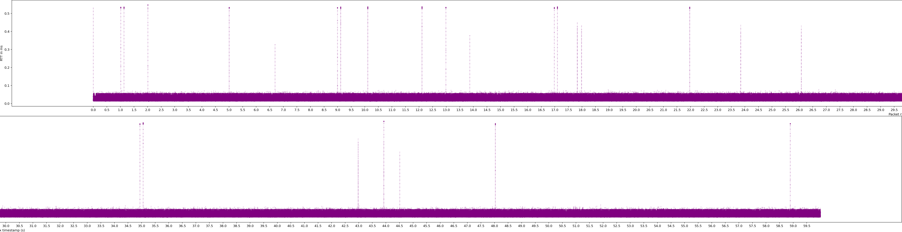

# Time-latency-distribution

A basic script used for plotting time-latency distribution from binary data captured by my TRex fork: https://github.com/theodorsm/trex-core

## Requirements

- python >=3.3 (venv)
- pip

## Running

### Getting started

```bash
# Initial setup (once)
python -m venv venv
pip install -r requirements.txt

# Activate (everytime)
source venv/bin/activate
```

### Example

```bash
./make_plot.py data/<SOME_TREX_DATA>.data <NEW_FILENAME>
```

Plot will be saved as `./plots/PLOT_<NEW_FILENAME>.png`.


`convert.sh` will split and tile the plots:



### Data format

A binary file of float cpp-types.

This is how it is written to file in CPP:

```cpp
myfile.write( reinterpret_cast<const char*>( &time ), sizeof ( float )); // elapsed time since start
myfile.write( reinterpret_cast<const char*>( &lat ), sizeof ( float )); // latency
```
