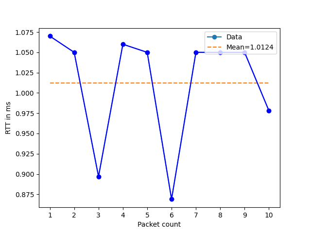

# Basic RTT generator & plot with ping

A basic script used for plotting RTT from ping.
Useful for getting a quick insight in the state of a link.

## Requirements

- python3
- pip

## Running

### Getting started

```bash
# Initial setup (once)
python -m venv venv
pip install -r requirements.txt

# Activate (everytime)
source venv/bin/activate
```

### Example

```bash
./generate_rtt.sh -c 10 -d 10.0.0.1
```

Plot will be saved as `./plots/PLOT_<TIMESTAMP>.png` and log file with data is found under `./rt_log/<TIMESTAMP>.log`


